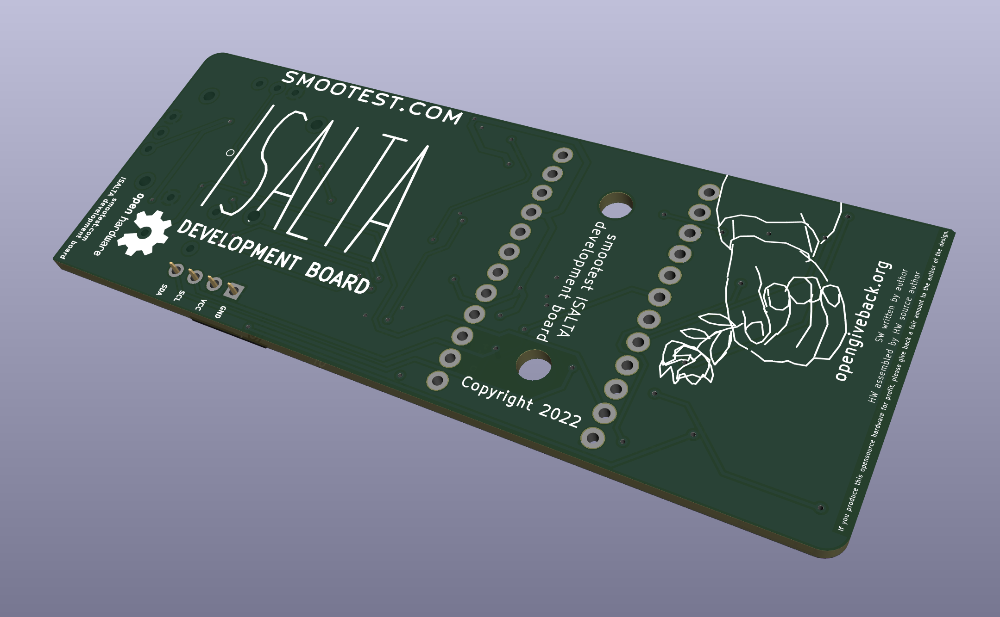

# isalta
The ISALTA development board to ease creating and learning about USB HID devices (keyboard, joysticks, mouse). For Arduino Pro Micro 32U4 based board. Contains buttons, 2812 programmable LEDs and an analog joystick. It also has I2C bus broken out on a socket compatible with I2C OLED display modules.

The lowest cost way to enable achieving all imaginable functionalities for USB HID input devices.

The clsrdy concept and the board is designed and maintained in Serbia by Milos Stojanovic.

This repository contains GPLv3 licensed opensource sourcecode for software examples and hardware PCB production gerbers.

More information on the official website http://www.smootest.com/isalta

The name of the board, "ISALTA", is a word from Tagalog language (Phillipino) and has a definition of:

isalta (isinasalta, isinalta, isasalta) v., inf. 1. bring upstairs; 2. put something on an elevated place
